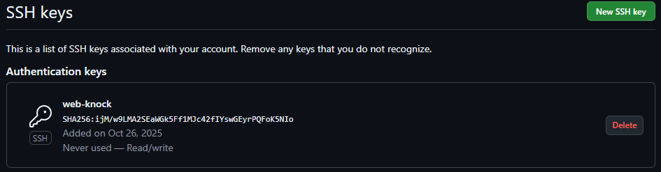
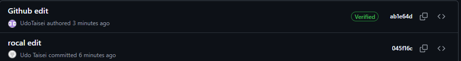
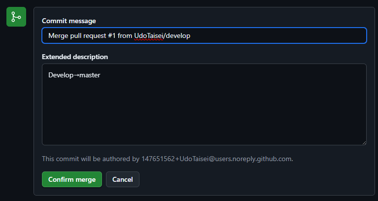
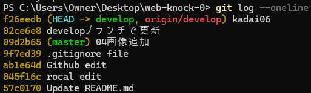
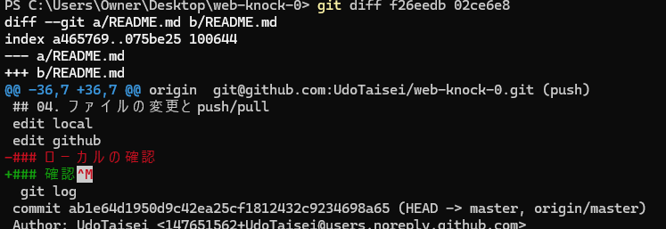

# knock-0

## 00. Gitのインストールとバージョン確認
### コマンド実行結果
PS C:\Users\Owner\Desktop\web-knock-0> git --version
git version 2.46.1.windows.1

## 01. リポジトリの初期化と最初のコミット
### 初期コミットまでのコマンド履歴
PS C:\Users\Owner\Desktop\web-knock-0> git init
Initialized empty Git repository in C:/Users/Owner/Desktop/web-knock-0/.git/
PS C:\Users\Owner\Desktop\web-knock-0> echo "knock-0" >>README.md
PS C:\Users\Owner\Desktop\web-knock-0> git add README.md
PS C:\Users\Owner\Desktop\web-knock-0> git commit -m "first commit"
[master (root-commit) de9625b] first commit
 1 file changed, 0 insertions(+), 0 deletions(-)
 create mode 100644 README.md
### コミットID
de9625b4e41a0cb50b071fa00acd58c10f10bb7e
 
## 02. GitHubアカウントの作成とSSHキー登録

PS C:\Users\Owner\Desktop\web-knock-0> ssh -T git@github.com
The authenticity of host 'github.com (20.27.177.113)' can't be established.
ED25519 key fingerprint is SHA256:+DiY3wvvV6TuJJhbpZisF/zLDA0zPMSvHdkr4UvCOqU.
This key is not known by any other names.
Are you sure you want to continue connecting (yes/no/[fingerprint])? yes
Warning: Permanently added 'github.com' (ED25519) to the list of known hosts.
Hi UdoTaisei! You've successfully authenticated, but GitHub does not provide shell access.

## 03. ローカルリポジトリとGitHubリポジトリの連携
PS C:\Users\Owner\Desktop\web-knock-0> git remote -v
origin  git@github.com:UdoTaisei/web-knock-0.git (fetch)
origin  git@github.com:UdoTaisei/web-knock-0.git (push)

## 04. ファイルの変更とpush/pull
edit local
edit github
### ローカルの確認
 git log
commit ab1e64d1950d9c42ea25cf1812432c9234698a65 (HEAD -> master, origin/master)
Author: UdoTaisei <147651562+UdoTaisei@users.noreply.github.com>
Date:   Sun Oct 26 17:00:50 2025 +0900

    Github edit

commit 045f16cd22a065277c9c7cdc7f4682c6e4adafb1
Author: Udo Taisei <taiqingyoudong@gmail.com>
Date:   Sun Oct 26 16:58:27 2025 +0900

    rocal edit
### リモートの確認

## 05. .gitignoreファイルの作成
### .gitignoreファイルの内容
node_modules/
### 反映後
PS C:\Users\Owner\Desktop\web-knock-0> git status
On branch master
Your branch is up to date with 'origin/master'.

nothing to commit, working tree clean

## 06. ブランチの作成と切り替え
developブランチでの変更

PS C:\Users\Owner\Desktop\web-knock-0> git branch
\* master
PS C:\Users\Owner\Desktop\web-knock-0> git branch develop
PS C:\Users\Owner\Desktop\web-knock-0> git branch
  develop
\* master
PS C:\Users\Owner\Desktop\web-knock-0> git switch develop
M       README.md
Switched to branch 'develop'
PS C:\Users\Owner\Desktop\web-knock-0> git branch
\* develop
  master

## 07. Pull Request（PR）の作成

## 08. 過去のコミット履歴の確認と差分の確認
### ログの確認

### 差分の確認
