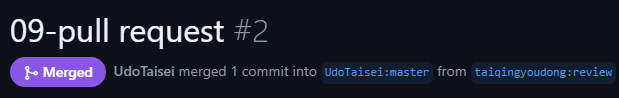

# 09. チーム開発体験：他の学生のリポジトリにコントリビュート
fork元URL：　https://github.com/UdoTaisei/web-knock-0  
fork先URL：　https://github.com/taiqingyoudong/web-knock-0

## fork元　修正前の文書

## fork先で文書を修正

## pull request を送る

## fork元のアカウントでpull requestをマージする

## 反映されていることを確認
